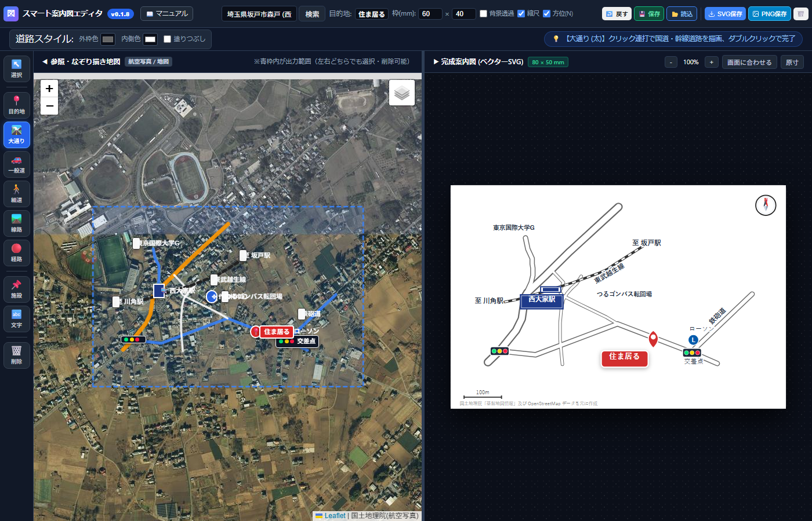
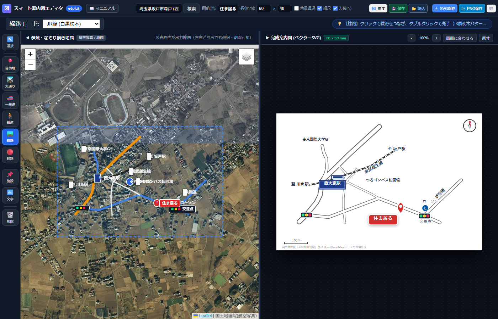
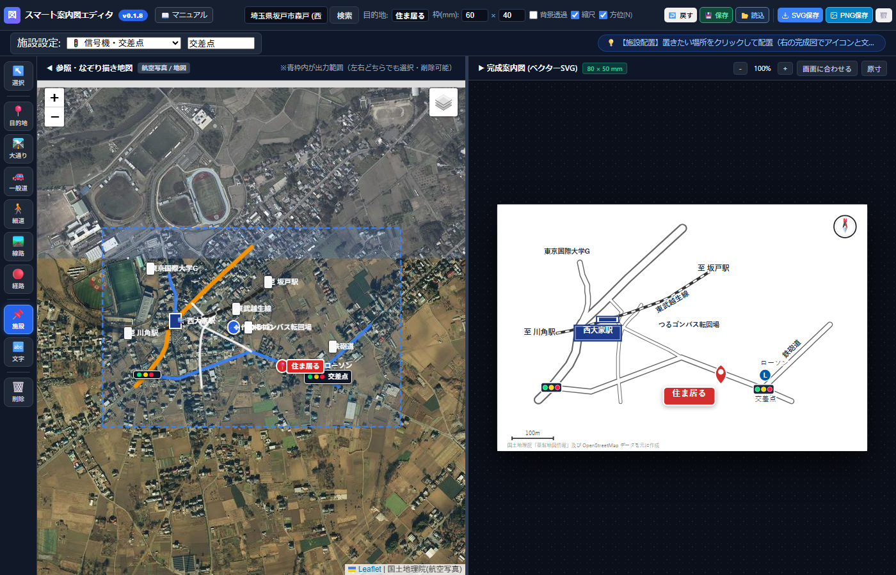

# スマート案内図エディタ 公式操作マニュアル (v0.1.11)

プロレベルの不動産案内図・建築確認申請見取図が、**実地図をなぞるだけで直感的に2〜3分で完成！**  
Illustratorでの重労働（ペンツールのベジェ曲線引きやパスファインダーでの交差点合体）はもう不要です。**左ツールバーを上から順番に使っていくだけ**で、誰でも思い通りの美しい案内図を作成できます。

*図1: 実例「住ま居る」案内図（左：なぞり描き航空写真 / 右：完成案内図ベクターキャンバス）*

---

## ★ 本ツールの最大の特長と圧倒的なメリット

### 1. Googleマップの「距離を測定」感覚でなぞるだけ
Googleマップで道路に沿ってポチポチと点を打って距離を測る機能と同じ感覚で、道路や線路の**流心（中心線）をクリックしていくだけ**で、地球上の緯度経度を自動取得し、外枠線（ケーシング）付きのベクター道路やJR枕木・私鉄2重線がリアルタイムに立ち上がります。

### 2. SVG書き出し（ベクトルデータ）だから拡大・縮小も自由自在！
- **画質劣化ゼロ:** どれだけ拡大しても文字や道路の線が絶対にボケたりギザギザになりません。
- **チラシのレイアウト変更に超強い:** B4折込チラシの角の狭い枠、A4パンフレットのワイドな横長枠、ポスターの特大枠など、入れたいスペースに合わせて縦横自在に拡大・縮小して何度でも活用できます。
- **Illustratorで完全編集可能:** SVG保存したデータはAdobe Illustratorで開けば、パス単位・文字単位でそのまま微調整できます。

### 3. 【新機能】1/2500 国土地理院白図による建築確認申請用「付近見取図」作成
ヘッダーの **「📑 確認申請 (1/2500)」** ボタンを押すだけで、建築確認申請や開発許可申請の添付図面（建築基準法施行規則第1条の3準拠）を即座に作成可能！
- **1/2,500 法定標準縮尺:** A4用紙（297×210mm等）において 1mm = 2.5m を自動計算。50m / 100m / 200m の測定スケールバーを自動配置。
- **国土地理院 白地図・淡色地図:** 申請実務で最も使われる淡色地図や白地図を背景として自動合成。
- **表題欄（地名地番・住居表示ボックス）:** 申請地 地名地番、住居表示、縮尺、作成日を美麗な申請用ブロックで自動描画。
- **申請地シンボル（◎）:** 赤二重丸＋「申請地」バッジで現地を分かりやすくハイライト。
- 白図の上に、既存の「施設スタンプ」「文字」「道路」をそのまま重ねて自由に追加できます。

---

## 左ツールバーを上から順に使っていくだけ！完全操作手順

### 基本: ↖️ 選択ツール (ショートカット: `V`)
配置した要素の移動、プロパティ編集、削除を行います。
- **個別ドラッグ移動:** 現地ピン本体だけでなく「住ま居る」の文字プレート、駅名プレート、アイコンなどを別々にドラッグして好きな位置へ微調整できます。
- **ダブルクリックで編集:** 文字や施設をダブルクリックするとモーダルが開き、文字の変更・回転・色選択がパッと行えます。

---

### STEP 1: 📍 目的地ツール (現地・販売区画)
案内図の主役となる「現地」「モデルハウス」「販売区画」の場所を決めます。
- ツールを選び、左側の地図上で物件のある場所をカチッと1回クリックするだけ。
- 右側の案内図に赤いピンと名称プレート（例：「住ま居る」）が配置されます。
- プレート色は赤・青・緑・濃紺/黒・オレンジから自由に変更可能です。

---

### STEP 2: 🛣️ 大通り / 🚗 一般道 / 🚶 細道ツール (流心なぞり描き)
道路の真ん中（流心）をクリックしていくだけで、外枠線（ケーシング）と道幅が自動生成されます。

*図2: 道路ツール選択時（上部に外枠色・内側色・塗りつぶしインスペクターが表示されます）*

- **なぞり描きのコツ:**
  1. 左画面の実地図または航空写真上で、道路の**流心（中心線）をクリック連打**して線を伸ばしていきます。
  2. 直線道路は交差点と角の2〜3点、カーブは曲がりに沿って適度な間隔で4〜5点クリックします。
  3. 終点で**ダブルクリック**すると描画が完了します。
  4. **交差点同士が全自動で綺麗に一体化（マージ）**されます！

---

### STEP 3: 🚆 線路ツール (JR枕木ストライプ / 私鉄2重白抜き線)
実在する鉄道の線路をなぞって描画します。

*図3: 東武越生線をなぞる様子（JR線 白黒枕木 / 私鉄線 2重白抜き実線）*

- 線路の中心をクリック連打でなぞり、ダブルクリックで完了します。

---

### STEP 4: 🔴 経路ツール (アクセス赤点線)
最寄り駅から物件現地までのルートをクリック連打でなぞると、チラシで一番目立つ「赤点線ルート」が引かれます。

---

### STEP 5: 🏪 施設配置ツール (駅・信号機・スーパー・コンビニ)
道案内の目印となる駅舎、信号機、商業施設スタンプを配置します。

*図4: 西大家駅、ローソン、交差点信号機などを配置*

- **「ただの信号機（交差点名なし）」にするプロ技:**
  信号機を配置したあと、文字部分だけを選択して `Delete` キーを押すか、プロパティモーダル内の「📝 文字のみ削除」を押すだけで、交差点名のないリアルな信号機イラスト単体になります！

---

### STEP 6: 🔤 文字配置ツール (通り名・至〜駅・カギ型引き出し線)
道路の通称（鉄砲道など）や線路の行き先（至 坂戸駅、至 川角駅）を配置します。
- **文字の斜め回転:** 道路や線路の傾きに合わせて、ワンタップで `-30°`、`-45°`、`30°` などに傾けられます（例: 東武越生線=-30°、鉄砲道=-45°）。
- **カギ型引き出し線:** 密集地で文字が重なる場合、引き出し線をONにすると、文字位置と指し示す○印の両方をドラッグして美しくクランク配置できます。

---

### STEP 7: 🗑️ 削除ツール
消したい道路や施設、文字をクリックして次々に消去できる消しゴムモードです。間違えて消しても `Ctrl + Z` で元通りに復元できます。

---

## 詳細プロパティ編集モーダル

駅名や施設、文字、目的地プレートをダブルクリックすると、大きな編集モーダルが表示されます。

*図5: 駅（西大家駅）のプロパティモーダル*

- **改行で自動折り返し:** テキスト入力でEnterを押すと、案内図上で自動的に上下中央揃えに折り返され、背景枠も自動追従します。
- **文字サイズ:** スライダーまたは [小 10] [中 12] [大 15] [特大 18] ボタン。
- **文字回転:** ワンタップボタン [0°] [30°] [-30°] [45°] [-45°] [60°] [-60°] [90°]。
- **記号サイズ倍率:** 0.5倍〜2.5倍。
- **プレート塗りつぶし色:** 赤・青・緑・濃紺/黒・オレンジ。
- **カギ型引き出し線:** チェックをONでクランク型折れ線を表示。両端ドラッグ可能。
- **文字のみ削除:** 信号機や施設で、テキストだけを消して記号スタンプのみ残す。

---

## 保存・復元・書き出し

- **💾 保存 (Ctrl+S):** 作図データ全体を JSON ファイルとしてPCに保存します。
- **📂 読込:** 保存した JSON ファイルを読み込めば、いつでも作図の続きを再開できます。
- **SVG保存 (おすすめ):** Adobe Illustrator等でパス単位で完全編集できる高品位ベクターデータを書き出します。
- **PNG保存:** チラシ印刷用（350dpi相当）の超高解像度透過/白背景PNG画像を書き出します。

---

## バージョン管理・デプロイ運用規定

- **現在のバージョン**: **`v0.1.9`** (`frontend/js/version.js` および `js/version.js` にて一元管理)
- **厳守ルール**:
  - 詳細は [DEPLOY_RULES.md](DEPLOY_RULES.md) を参照。
  - いかなる些細な修正でも末尾のバージョン番号を +1 します。
  - トップ・ミドル数字（`0.1`）は管理者の指示以外では変更しません。
  - Git Push 直前には必ず物理バックアップスクリプト（`scripts/backup.js`）を実行し、Push完了後は必ず本番SSHデプロイコマンド（`ssh -o BatchMode=yes -p 10022 mdo3@mdo3.xsrv.jp "cd mdo3.com/public_html/map && git pull origin main"`）を実行します。
